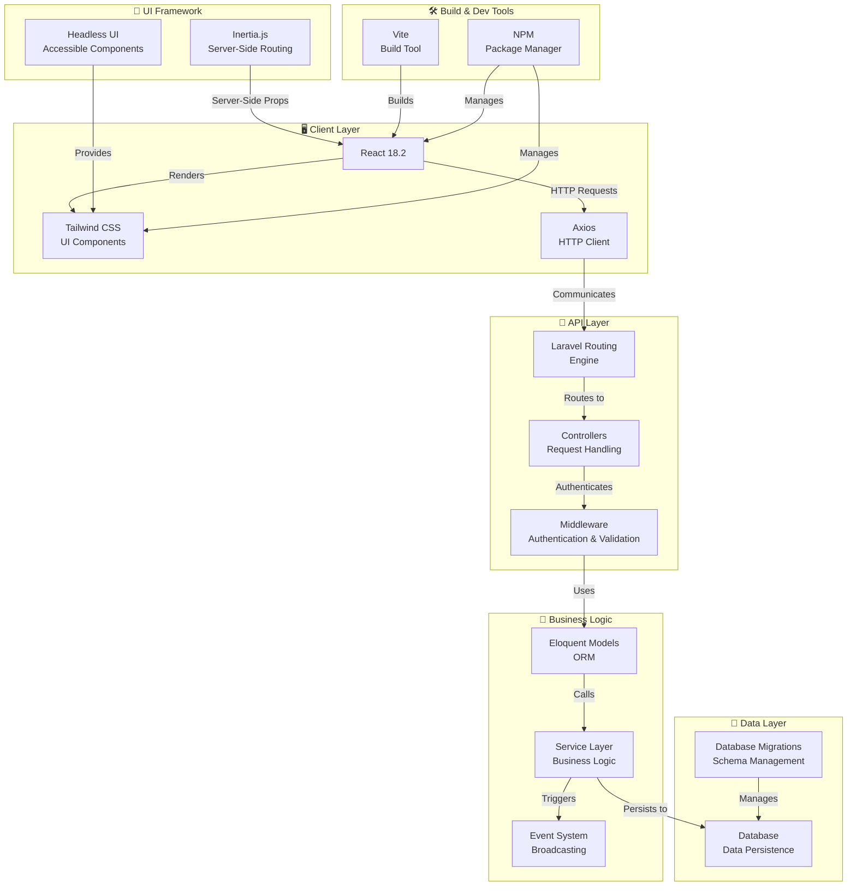

# Clacker - Architecture Overview

## System Architecture

Clacker is a modern web application built with a Laravel backend and a React frontend, utilizing the Inertia.js framework for seamless server-side routing with client-side reactivity.



## Architecture Components

### Frontend (Client Layer)
- **React 18.2**: Modern UI library for building interactive user interfaces
- **Tailwind CSS**: Utility-first CSS framework for styling
- **Axios**: HTTP client for making API requests to the backend
- **@headlessui/react**: Unstyled, accessible UI components
- **Inertia.js**: Framework that glues Laravel and React together without building an API

### Backend (Server Layer)
- **Laravel Framework**: PHP web application framework providing:
  - Expressive routing engine
  - Powerful dependency injection container
  - Request validation and middleware
  - Eloquent ORM for database interactions
- **Controllers**: Handle incoming requests and return responses
- **Models**: Eloquent models for database entities
- **Services**: Business logic abstraction layer
- **Middleware**: Request/response filtering and authentication

### Data Layer
- **Database**: Persistent data storage
- **Migrations**: Version-controlled database schema management
- **Eloquent ORM**: Object-relational mapping for database queries

### Development & Build Tools
- **Vite**: Fast build tool and development server
- **npm**: Package management for JavaScript dependencies
- **Laravel Vite Plugin**: Integration between Laravel and Vite

## Data Flow

1. **User Action** → Browser triggers a request
2. **Frontend** → React component sends HTTP request via Axios
3. **API Route** → Laravel router directs request to appropriate controller
4. **Validation** → Middleware validates request data
5. **Processing** → Controller uses services and models to process request
6. **Database** → Data is queried or persisted
7. **Response** → Controller returns response (usually as props for Inertia)
8. **Frontend Update** → Inertia updates React component with new props
9. **UI Render** → React re-renders with Tailwind styling

## Key Technologies

| Layer | Technology | Purpose |
|-------|-----------|----------|
| Frontend | React 18.2 | UI Framework |
| Styling | Tailwind CSS 3.2 | Utility CSS |
| Framework Bridge | Inertia.js 1.0 | Server-side routing for React |
| Backend | Laravel | Web Framework |
| Build Tool | Vite 6.0 | Module bundler |
| HTTP Client | Axios 1.7 | API Communication |
| Utilities | dayjs 1.11 | Date/Time handling |

## Development Workflow

```
npm run dev     → Starts Vite dev server + Laravel
npm run build   → Builds optimized production bundle
```

## Benefits of This Architecture

✅ **Single Page Application** - Smooth user experience without full page reloads  
✅ **Server-Side Rendering** - SEO-friendly with server-side props handling  
✅ **Shared Validation** - Rules can be validated on both backend and frontend  
✅ **Type Safety** - PHP on backend, JavaScript/React on frontend  
✅ **Modern Tooling** - Vite for fast development and optimized builds  
✅ **Scalable** - Service layer allows for clean separation of concerns  

## Deployment Architecture

```
┌─────────────────────────────┐
│     Web Server (Nginx)      │
│   - Reverse Proxy           │
│   - Static Files            │
└──────────┬──────────────────┘
           │
┌──────────▼──────────────────┐
│   Application Server        │
│   - PHP-FPM / Laravel       │
│   - React SPA (Built)       │
│   - Session Management      │
└──────────┬──────────────────┘
           │
┌──────────▼──────────────────┐
│    Database Server          │
│    - MySQL/PostgreSQL       │
│    - Data Persistence       │
└─────────────────────────────┘
```

## Scalability Considerations

- **Horizontal Scaling**: Stateless application servers can be scaled horizontally
- **Caching**: Redis/Memcached for session and query caching
- **Database**: Connection pooling, read replicas for scaling
- **Static Assets**: CDN distribution of compiled React and CSS
- **Queue Workers**: Background job processing with Laravel Queues

## Security Layers

1. **Authentication Middleware** - Guards protected routes
2. **CSRF Protection** - Prevents cross-site request forgery
3. **Request Validation** - Input sanitization and validation
4. **Database Escaping** - Protection against SQL injection via Eloquent
5. **HTTPS/TLS** - Encrypted data transmission
6. **CORS Configuration** - Cross-origin request handling
